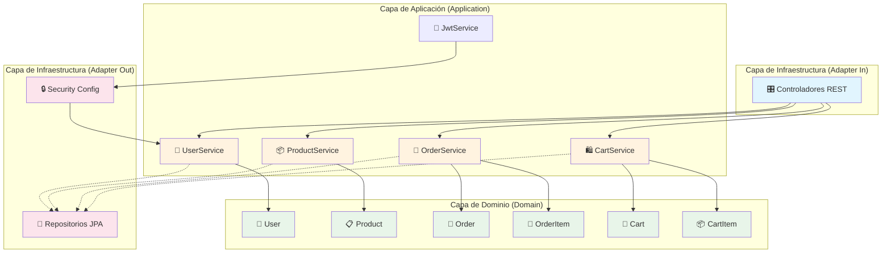
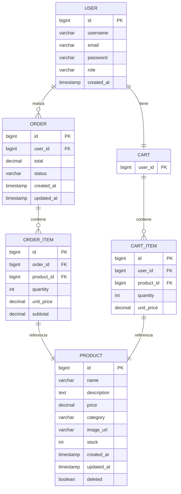
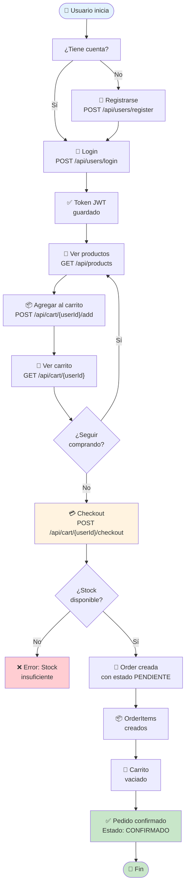

# TechLab E-Commerce API

API RESTful para gestión de e-commerce con **Arquitectura Hexagonal** y **Java 21**.

## Características

- **Arquitectura Hexagonal**: Separación clara entre dominio, aplicación e infraestructura
- **Java 21**: Utiliza las últimas características del lenguaje
  - Pattern matching en switch
  - Sequenced collections
  - Records para DTOs
- **Spring Boot 3.2.5**: Framework principal
- **Spring Security**: Autenticación JWT
- **SpringDoc OpenAPI**: Documentación automática con Swagger

---

## Instalación

### 1. Clonar el proyecto

```bash
git clone <repository-url>
cd techlab_ecommerce_api
```

### 2. Configurar variables de entorno

Copia el archivo de ejemplo y edítalo con tus valores:

```bash
cp .env.example .env
```

Edita el archivo `.env` con tus configuración:

```env
# ============================================
# TechLab E-Commerce - Variables de Entorno
# ============================================

# BASE DE DATOS
DB_HOST=localhost
DB_PORT=3306
DB_NAME=techlab_db
DB_USER=tu_usuario
DB_PASSWORD=tu_password_seguro

# JWT - Autenticación (usa una clave larga y segura)
JWT_SECRET=tu_super_secret_key_de_al_menos_256_bits
JWT_EXPIRATION=86400000

# SERVIDOR
SERVER_PORT=8080
```

### 3. Ejecutar con Docker (Recomendado)

```bash
# Levantar toda la aplicación
docker-compose up -d

# Ver logs
docker-compose logs -f app

# Detener
docker-compose down -v
```

### 4. Ejecutar Localmente

```bash
# Compilar
mvn clean package -DskipTests

# Ejecutar
mvn spring-boot:run

# O ejecutar el JAR directamente
java -jar target/techlab-ecommerce-1.0.0.jar
```

---

## Configuración de Variables de Entorno

| Variable | Descripción | Valor por Defecto |
|----------|-------------|-------------------|
| `DB_HOST` | Host de MySQL | localhost |
| `DB_PORT` | Puerto de MySQL | 3306 |
| `DB_NAME` | Nombre de la base de datos | techlab_db |
| `DB_USER` | Usuario de MySQL | techlab_user |
| `DB_PASSWORD` | Contraseña de MySQL | (vacío) |
| `JWT_SECRET` | Clave secreta para JWT (mínimo 256 bits) | (obligatorio) |
| `JWT_EXPIRATION` | Tiempo de expiración del token (ms) | 86400000 (24h) |
| `SERVER_PORT` | Puerto del servidor | 8080 |

---

## Roles y Permisos

### Roles Disponibles

| Rol | Descripción |
|-----|-------------|
| `ADMIN` | Administrador del sistema, acceso total |
| `USER` | Usuario regular, acceso a sus propios recursos |

### Permisos por Endpoint

#### Endpoints Públicos (sin autenticación)

| Método | Endpoint | Descripción |
|--------|----------|-------------|
| `POST` | `/api/users/register` | Registrar nuevo usuario |
| `POST` | `/api/users/login` | Iniciar sesión |
| `GET` | `/api/products` | Listar productos |
| `GET` | `/api/products/{id}` | Ver producto |
| `GET` | `/api/products/search` | Buscar productos |
| `GET` | `/api/products/category/{category}` | Filtrar por categoría |
| `GET` | `/api/orders/user/{userId}` | Ver historial de pedidos |
| `GET` | `/swagger-ui/**` | Documentación Swagger |
| `GET` | `/v3/api-docs/**` | OpenAPI JSON |

#### Endpoints Protegidos (requieren JWT)

| Método | Endpoint | USER | ADMIN | Descripción |
| --- | --- | --- | --- | --- |
| `POST` | `/api/products` | ❌ | ✅ | Crear producto |
| `PUT` | `/api/products/{id}` | ❌ | ✅ | Actualizar producto |
| `DELETE` | `/api/products/{id}` | ❌ | ✅ | Eliminar producto |
| `GET` | `/api/orders` | ❌ | ✅ | Listar todos los pedidos |
| `GET` | `/api/orders/{id}` | 👤 | ✅ | Ver detalle de pedido |
| `POST` | `/api/orders` | ✅ | ✅ | Crear pedido |
| `PUT` | `/api/orders/{id}/status` | ❌ | ✅ | Cambiar estado |
| `DELETE` | `/api/orders/{id}` | 👤 | ✅ | Cancelar pedido |
| `GET` | `/api/cart/{userId}` | 👤 | ✅ | Ver carrito |
| `POST` | `/api/cart/{userId}/add` | 👤 | ✅ | Agregar al carrito |
| `PUT` | `/api/cart/{userId}/update/{productId}` | 👤 | ✅ | Actualizar carrito |
| `DELETE` | `/api/cart/{userId}/remove/{productId}` | 👤 | ✅ | Eliminar del carrito |
| `POST` | `/api/cart/{userId}/checkout` | 👤 | ✅ | Finalizar compra |
| `GET` | `/api/users` | ❌ | ✅ | Listar usuarios |
| `GET` | `/api/users/{id}` | 👤 | ✅ | Ver usuario |

**Leyenda:**
- ✅ = Permitido
- ❌ = Denegado
- 👤 = Solo el propietario del recurso

### Autorización Basada en Roles (RBAC)

```
ADMIN tiene acceso completo a todos los endpoints.

USER tiene acceso a:
  - Sus propios pedidos (ver, crear, cancelar)
  - Su propio carrito (ver, modificar, checkout)
  - Información pública de productos
  - Su propia información de usuario
```

---

## Estructura del Proyecto

```
src/main/java/com/techlab/
├── application/          # Casos de uso
│   ├── ports/in/        # Interfaces de entrada (UseCases)
│   ├── ports/out/       # Interfaces de salida (Repositories)
│   └── services/        # Implementaciones de servicios
├── domain/              # Núcleo del negocio
│   ├── model/           # Entidades de dominio
│   ├── exceptions/      # Excepciones personalizadas
│   └── enums/           # Enumeraciones
├── infrastructure/      # Adaptadores
│   ├── adapters/in/     # Controladores REST
│   ├── adapters/out/    # Repositorios JPA
│   └── config/          # Configuraciones
└── shared/              # DTOs compartidos
```

---

## Diagrama de Arquitectura Hexagonal



---

## Diagrama Entidad-Relación (DER)



---

## Diagrama de Flujo (Checkout de Pedido)



---

## Modelo de Datos Detallado

### User (Usuario)

| Campo | Tipo | Descripción |
| --- | --- | --- |
| `id` | Long | Identificador único |
| `username` | String | Nombre de usuario (único) |
| `email` | String | Email (único) |
| `password` | String | Contraseña (encriptada) |
| `role` | Enum | ADMIN o USER |
| `createdAt` | LocalDateTime | Fecha de creación |

### Product (Producto)

| Campo | Tipo | Descripción |
| --- | --- | --- |
| `id` | Long | Identificador único |
| `name` | String | Nombre del producto |
| `description` | String | Descripción |
| `price` | BigDecimal | Precio unitario |
| `category` | String | Categoría |
| `imageUrl` | String | URL de imagen |
| `stock` | Integer | Stock disponible |
| `deleted` | Boolean | Soft delete |
| `createdAt` | LocalDateTime | Fecha de creación |
| `updatedAt` | LocalDateTime | Última actualización |

### Order (Pedido)

| Campo | Tipo | Descripción |
| --- | --- | --- |
| `id` | Long | Identificador único |
| `userId` | Long | FK a User |
| `total` | BigDecimal | Total del pedido |
| `status` | Enum | PENDIENTE, CONFIRMADO, ENVIADO, ENTREGADO, CANCELADO |
| `items` | List\<OrderItem\> | Items del pedido |
| `createdAt` | LocalDateTime | Fecha de creación |
| `updatedAt` | LocalDateTime | Última actualización |

### OrderItem (Item de Pedido)

| Campo | Tipo | Descripción |
| --- | --- | --- |
| `id` | Long | Identificador único |
| `orderId` | Long | FK a Order |
| `productId` | Long | FK a Product |
| `quantity` | Integer | Cantidad |
| `unitPrice` | BigDecimal | Precio al momento de compra |
| `subtotal` | BigDecimal | quantity × unitPrice |

### Cart (Carrito)

| Campo | Tipo | Descripción |
| --- | --- | --- |
| `userId` | Long | PK (uno por usuario) |
| `items` | List\<CartItem\> | Items en el carrito |

### CartItem (Item de Carrito)

| Campo | Tipo | Descripción |
| --- | --- | --- |
| `id` | Long | Identificador único |
| `userId` | Long | FK a User |
| `productId` | Long | FK a Product |
| `quantity` | Integer | Cantidad |
| `unitPrice` | BigDecimal | Precio al momento de agregar |

---

## Endpoints Principales

### Productos
| Método | Endpoint | Descripción |
|--------|----------|-------------|
| GET | `/api/products` | Listar todos los productos |
| GET | `/api/products/{id}` | Obtener producto por ID |
| POST | `/api/products` | Crear producto |
| PUT | `/api/products/{id}` | Actualizar producto |
| DELETE | `/api/products/{id}` | Eliminar producto (soft delete) |
| GET | `/api/products/search?text=` | Buscar por nombre/categoría |
| GET | `/api/products/category/{category}` | Filtrar por categoría |

### Pedidos
| Método | Endpoint | Descripción |
|--------|----------|-------------|
| GET | `/api/orders` | Listar todos (ADMIN) |
| GET | `/api/orders/{id}` | Obtener pedido por ID |
| GET | `/api/orders/user/{userId}` | Historial de pedidos |
| POST | `/api/orders` | Crear pedido |
| PUT | `/api/orders/{id}/status` | Actualizar estado |
| DELETE | `/api/orders/{id}` | Cancelar pedido |

### Carrito
| Método | Endpoint | Descripción |
|--------|----------|-------------|
| GET | `/api/cart/{userId}` | Obtener carrito |
| POST | `/api/cart/{userId}/add` | Agregar producto |
| PUT | `/api/cart/{userId}/update/{productId}` | Actualizar cantidad |
| DELETE | `/api/cart/{userId}/remove/{productId}` | Eliminar producto |
| POST | `/api/cart/{userId}/checkout` | Finalizar compra |

### Usuarios
| Método | Endpoint | Descripción |
|--------|----------|-------------|
| POST | `/api/users/register` | Registrar usuario |
| POST | `/api/users/login` | Iniciar sesión |
| GET | `/api/users` | Listar usuarios (ADMIN) |
| GET | `/api/users/{id}` | Obtener usuario por ID |

---

## Ejemplos JSON

### Registrar Usuario
```json
POST /api/users/register
{
  "username": "nuevouser",
  "email": "nuevo@example.com",
  "password": "Password123!",
  "role": "USER"
}
```

### Iniciar Sesión
```json
POST /api/users/login
{
  "username": "admin",
  "password": "Admin123!"
}
```

**Respuesta:**
```json
{
  "token": "eyJhbGciOiJIUzI1NiIsInR5cCI6IkpXVCJ9...",
  "type": "Bearer",
  "userId": 1,
  "username": "admin",
  "role": "ADMIN"
}
```

### Crear Producto (requiere JWT ADMIN)
```json
POST /api/products
Authorization: Bearer <token>
{
  "name": "Laptop Dell XPS 15",
  "description": "Laptop de alta gama",
  "price": 1200.00,
  "category": "Electrónica",
  "imageUrl": "https://example.com/laptop.jpg",
  "stock": 10
}
```

### Crear Pedido (requiere JWT)
```json
POST /api/orders
Authorization: Bearer <token>
{
  "userId": 1,
  "items": [
    {"productId": 1, "quantity": 2},
    {"productId": 2, "quantity": 1}
  ]
}
```

---

## Estados de Pedido

| Estado | Descripción |
|--------|-------------|
| `PENDIENTE` | Pedido creado, esperando confirmación |
| `CONFIRMADO` | Pago confirmado |
| `ENVIADO` | En tránsito |
| `ENTREGADO` | Entregado al cliente |
| `CANCELADO` | Pedido cancelado |

---

## Documentación API

- **Swagger UI**: http://localhost:8080/swagger-ui.html
- **OpenAPI JSON**: http://localhost:8080/v3/api-docs

---

## Tests

```bash
# Ejecutar todos los tests
mvn test

# Tests específicos
mvn test -Dtest=ProductServiceTest
mvn test -Dtest=OrderServiceTest
```

---

## Datos de Prueba

Al iniciar la aplicación se crean automáticamente:

### Usuarios

| Username | Email | Password | Rol |
| --- | --- | --- | --- |
| admin | admin@techlab.com | Admin123! | ADMIN |
| user | user@techlab.com | User123! | USER |

### Productos
- Laptop Dell XPS 15 - $1200.00 (10 unidades)
- Mouse Logitech MX Master 3 - $45.50 (25 unidades)
- Teclado Mecánico Corsair K70 - $85.00 (15 unidades)
- Monitor LG 27 inch 4K - $350.00 (8 unidades)
- Auriculares Sony WH-1000XM5 - $280.00 (12 unidades)

---

## Primeros Pasos (Quick Start)

### 1. Levantar el proyecto con Docker

```bash
docker-compose up -d
```

Espera ~30 segundos a que MySQL y la app inicien.

### 2. Abrir Swagger UI

Ve a: **`http://localhost:8080/swagger-ui.html`**

### 3. Probar el flujo completo

#### Paso 1: Login como admin

- En Swagger, ve a `POST /api/users/login`
- Click en **"Try it out"**
- Body:

```json
{
  "username": "admin",
  "password": "Admin123!"
}
```

- Click **Execute**
- Copia el `token` de la respuesta (empieza con `eyJ...`)

#### Paso 2: Usar el token en requests protegidas

- Click en el botón **"Authorize"** (arriba del todo en Swagger)
- Ingresa: `Bearer <tu_token>`
- Click **Authorize** → Close

#### Paso 3: Probar endpoints

- `GET /api/products` → lista productos (público)
- `POST /api/products` → crear producto (ADMIN, usa el token)
- `GET /api/cart/1` → ver carrito del usuario 1

---

## Troubleshooting

### Error: `Connection refused` o `Cannot connect to database`

**Causa:** MySQL no está corriendo.

**Solución:**

```bash
docker-compose ps
docker-compose logs app
docker-compose restart app
```

### Error: `JWT_SECRET is mandatory` o `Invalid JWT_SECRET`

**Causa:** No configuraste el `.env` o la clave es muy corta.

**Solución:**

```bash
# Verifica que el archivo .env exista y tenga:
JWT_SECRET=una_clave_muy_larga_y_segura_de_al_menos_256_bits
```

### Error: `Access Denied` en endpoints protegidos

**Causa:** No estás autenticado o tu token expiró.

**Solución:**

1. Haz login de nuevo en `POST /api/users/login`
2. Copia el nuevo token
3. Vuelve a hacer click en **Authorize** y actualiza el token

### Error: `User already exists` al registrar

**Causa:** El username o email ya están registrados.

**Solución:** Usa un username/email diferente, o usa los usuarios de prueba.

### Docker: puerto 3306 o 8080 ya en uso

**Causa:** Otra aplicación está usando esos puertos.

**Solución:**

```bash
# Ver qué está usando el puerto
lsof -i :8080
lsof -i :3306
```

### La app no levanta, sale error de Java version

**Causa:** Se requiere Java 21.

**Solución:**

```bash
java -version
# Si no es 21, usa SDKMAN:
sdk install java 21.0.2-tem
sdk use java 21.0.2-tem
```

### Verificar que todo funciona

```bash
# Health check
curl http://localhost:8080/api/products

# Login y obtener token
curl -X POST http://localhost:8080/api/users/login \
  -H "Content-Type: application/json" \
  -d '{"username":"admin","password":"Admin123!"}'
```

---

## Tecnologías

- Java 21
- Spring Boot 3.2.5
- Spring Data JPA
- Spring Security
- MySQL 8.0
- Lombok
- MapStruct
- JWT (jjwt)
- SpringDoc OpenAPI
- Docker / Docker Compose

---
